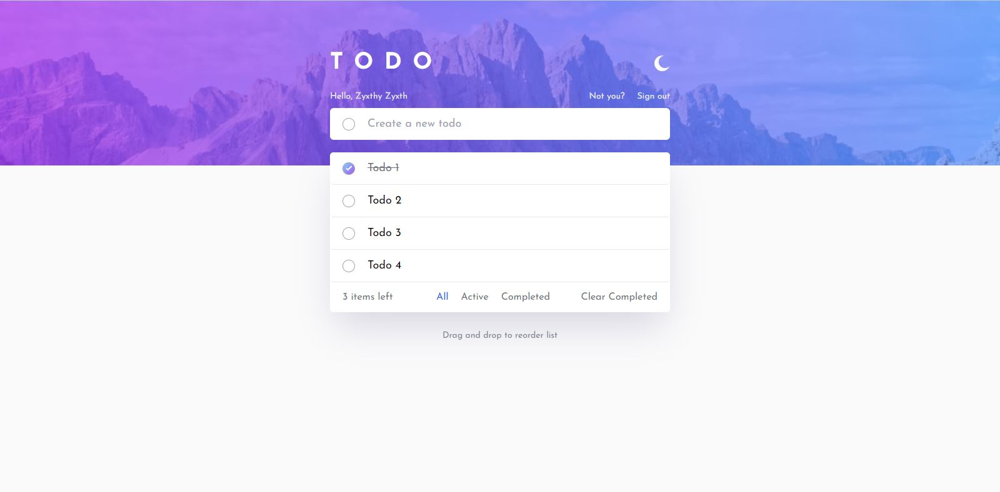
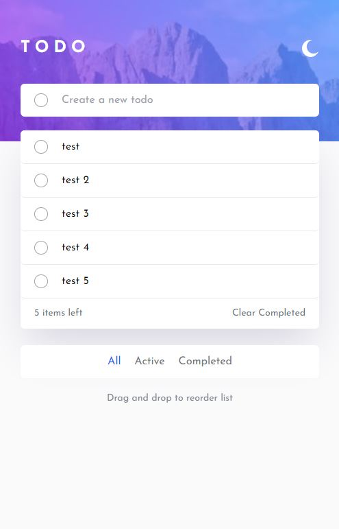

# Frontend Mentor - Todo app solution

This is a solution to the [Todo app challenge on Frontend Mentor](https://www.frontendmentor.io/challenges/todo-app-Su1_KokOW). Frontend Mentor challenges help you improve your coding skills by building realistic projects.

## Table of contents

- [Overview](#overview)
  - [The challenge](#the-challenge)
  - [Screenshot](#screenshot)
  - [Links](#links)
- [My process](#my-process)
  - [Built with](#built-with)
  - [What I learned](#what-i-learned)
  - [Useful resources](#useful-resources)

**Note: Delete this note and update the table of contents based on what sections you keep.**

## Overview

### The challenge

Users should be able to:

- View the optimal layout for the app depending on their device's screen size
- See hover states for all interactive elements on the page
- Add new todos to the list
- Mark todos as complete
- Delete todos from the list
- Filter by all/active/complete todos
- Clear all completed todos
- Toggle light and dark mode
- **Bonus**: Drag and drop to reorder items on the list

### Screenshot




### Links

- Solution URL: [Todo App with TypeScript, NextJS, Tailwind CSS and Firebase + authen](https://www.frontendmentor.io/solutions/todo-app-with-typescript-nextjs-tailwind-css-and-firebase-authen-Lr2zyeQ4jl)
- Live Site URL: [Todo App (Full stack)](https://fem-todos-firebase-goat.vercel.app/)

## My process

### Built with

- Semantic HTML5 markup
- CSS custom properties
- Flexbox
- CSS Grid
- Mobile-first workflow
- [React](https://reactjs.org/) - JS library
- [Next.js](https://nextjs.org/) - React framework
- TypeScript
- [TailwindCSS](https://tailwindcss.com/) — for styling
- [react-beautiful-dnd](https://github.com/atlassian/react-beautiful-dnd/tree/master) - for drag and drop
- [Firebase](https://firebase.google.com/) - For backend
- [React Firebase Hooks](https://github.com/CSFrequency/react-firebase-hooks)

### What I learned

Using react-beautiful-dnd with TypeScripts needs to install its types.

```
npm i --save-dev @types/react-beautiful-dnd
```

It also needs to be dynamically imported.

```js
import dynamic from "next/dynamic";
const MainSection = dynamic(() => import("./mainSection"), {
  ssr: false,
});
export default MainSection;
```

I made this project into a full stack app with Firebase as database.

It is better to keep index of the todo in separated array. Not in todo object itself so that we don't need to write many updates back to database.

I have also tried applying Firebase anon auth and account linking with Google provider to save user's data.

### Useful resources

- [Use react-beautiful-dnd With Next.js and TypeScript](https://levelup.gitconnected.com/using-react-beautiful-dnd-with-next-js-and-typescript-58a198b7266b) - For how to set up and debug issue with Next.js

- [Using react-beautiful-dnd with components example](https://codesandbox.io/s/zqwz5n5p9x?file=/src/index.js:824-1112)
